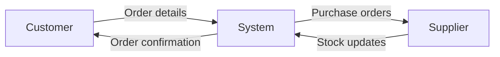

# Information Flow Diagrams Examples

## 1.1.9 Methods to represent decomposition

{ width="256" }  
New or significantly changed in this specification

## Example Question Scenario

A small online retailer sells books through a Customer Order System.

Customers browse the retailer’s website and submit orders for books they wish to purchase. The system records the order details and sends an order confirmation back to the customer.

When the system detects that stock levels are low, it automatically sends a purchase order to a book supplier requesting additional stock. The supplier responds by sending stock delivery information so that the system can update its records when new books arrive.

Payment for customer orders is processed by an external payment service provider, which receives payment details from the system and returns a payment confirmation.

## Task

Draw a Level 0 Information Flow Diagram (Context Diagram) for the Customer Order System.

Your diagram should include:

- the Customer Order System as a single process

- all relevant external entities

- the information flows between the entities and the system.

### (6 marks)

---

## What examiners typically expect (for your reference)

Students would normally identify:

### External entities

- Customer

- Supplier

Payment Service Provider

### System

- Customer Order System

### Information flows

- Order details

- Order confirmation

- Purchase order

- Stock delivery information

- Payment details

- Payment confirmation

---

## Flow Diagram

